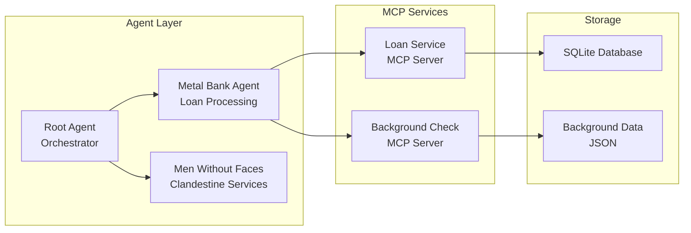

# The Metal Bank of Braavos Agent

## Understanding Agentic Protocols (MCP & A2A)

Before diving into the project, let's understand two fundamental protocols that enable sophisticated agent interactions:

### Model Context Protocol (MCP)

MCP is a standardized protocol that enables agents to interact with external tools and services. Think of it as a universal adapter that allows AI agents to:

- Call external APIs and services consistently
- Access specialized tools and functionalities
- Interact with databases and other data sources
- Handle complex operations beyond their core LLM capabilities

### Agent-to-Agent Protocol (A2A)

A2A is a communication protocol that enables agents to discover and interact with other agents, whether they're running locally or as remote services. It allows:

- Agents to discover other agents' capabilities
- Seamless communication between distributed agents
- Delegation of tasks to specialized agents
- Building complex, multi-agent systems

## Project Overview

The Metal Bank of Braavos is a sophisticated multi-agent application built using the Google Agent Development Kit (ADK). It simulates a fantasy-themed bank that processes loan applications and handles clandestine requests. This project serves as a practical demonstration of:

- Building multi-agent systems with specialized roles
- Implementing MCP servers for external tool integration
- Setting up A2A communication between distributed agents
- Creating a hierarchical agent architecture with delegated responsibilities
- Handling complex workflows through agent collaboration

## Setup

Detailed setup and environment instructions are maintained in `SETUP.md`.

## Architecture Deep Dive: A Roadmap for Agentic Protocols

The Metal Bank of Braavos employs a layered architecture to manage complex interactions between users, agents, and external services. For a high-level overview of the components and how they are started, please refer to the `Setup.md` file.

## System Architecture

The Metal Bank of Braavos uses a modern, microservices-based architecture that demonstrates best practices for building agent-based systems. The architecture is organized into several layers, each with specific responsibilities.

### Architecture Diagram

A detailed architecture diagram can be found in `arch.md`. Here's a high-level overview:

### Core Agents and Their Roles

The application's intelligence is distributed across several specialized agents:

- **Root Agent (Orchestrator)** - `src/adk_metalbank/agent.py`
  - Primary entry point for user interactions
  - Analyzes user intent to route requests
  - Decides between banking services (internal) and clandestine services (remote)
  - Uses local tools for basic authentication

- **Metal Bank Agent (Loan Officer)** - `src/adk_metalbank/agents/sub_agents/metal_bank_agent.py`
  - Manages core banking workflow
  - Performs background checks
  - Checks existing loans
  - Presents loan offers
  - Uses MCP services for external operations

- **Men Without Faces Remote Agent (Proxy)** - `src/adk_metalbank/agents/sub_agents/remote_agent.py`
  - Proxy for the remote clandestine service
  - Enables root_agent to delegate clandestine requests
  - Demonstrates A2A client implementation

- **Men Without Faces Agent (Clandestine)** - `src/agents/adk_menwithoutfaces/agent.py`
  - Independent microservice for clandestine requests
  - Communicates via A2A protocol
  - Shows how to implement a remote agent service

### Agent-to-Agent (A2A) Protocol Implementation

A2A enables seamless communication between agents, whether local or remote.

#### Calling a Remote Agent

In `src/adk_metalbank/agents/sub_agents/remote_agent.py`:

- Implements `RemoteA2aAgent` for the Men Without Faces service
- Uses `AgentCard` for service discovery
- Handles async communication with remote agents
- Manages request/response cycles

#### Implementing a Remote Agent (A2A Server)

In `src/adk_menwithoutfaces/agent.py` and related files:

- Uses `A2AStarletteApplication` for agent exposure
- Implements custom executor for request processing
- Handles agent lifecycle and state management
- Demonstrates proper error handling and responses

### MCP (Model-Context Protocol) Implementations

MCP enables agents to use external tools and services through a standardized interface.

#### Using MCP Tools in Agents

In `src/adk_metalbank/agents/sub_agents/tools.py`:

- Defines `MCPToolset` instances for different services
- Configures tool endpoints and authentication
- Maps tool functions to agent capabilities
- Handles tool response processing

#### Implementing MCP Servers

The project includes several MCP server implementations:

##### Loan Service - `src/loan_service/main.py`

- Uses the low-level `mcp.server` for a more involved setup
- Implements CRUD operations for loans
- Shows tool registration and routing

##### Background Check Service - `src/background_check_service/main.py`

- Uses the higher-level `FastMCP` implementation for a simpler setup
- Shows simple tool implementation

### Testing and Development

#### Testing MCP Servers

- Use [MCP Inspector](https://modelcontextprotocol.io/docs/tools/inspector) for testing
- Test tools independently before agent integration
- Validate request/response formats
- Check error handling

#### Local Development Tools

The project includes tools that are local to the agent :

- `men_without_faces_password_check`
- `calculate_loan_interest_rate`

## TODO

1. Frontend
2. Payment Protocol AP2 https://github.com/google-agentic-commerce/AP2/tree/main/samples/python/src/roles